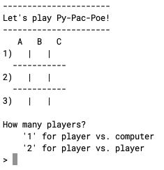

# Py-Pac-Poe

Console Tic-tac-toe




## Features

- Player vs. computer mode
- 2 player Mode

## Getting Started

With python 3.10+ installed:
```shell
python main.py
```

## Future

- Vary computer difficulty, too hard at the moment
- Build a front-end using Arcade or some other library